# AWS Serverless Application Model

## **Overview**

Serverless architecture is the way to build and run application without managing the infrastructure that enable you to build applications with increased agility and lower total cost of ownership. This reduced overhead lets developers reclaim time and energy that can be spent on developing great products which scale and that are reliable.

A serverless application is a combination of Lambda functions, event sources, and other resources that work together to perform tasks. [**AWS Serverless Application Model**](https://docs.aws.amazon.com/zh_tw/lambda/latest/dg/serverless_app.html) (AWS SAM) is an open-source framework that you can use to build serverless applications on AWS.

**AWS SAM** consists of the following components:

1. **AWS SAM template specification**: <br />Specification provides a simple and clean syntax to describe the functions, APIs, permissions, configuration, and events that make up a serverless application. You use an AWS SAM template file to operate on a single, deployable, versioned entity that's your serverless application.
2. **AWS SAM command line interface**(AWS SAM CLI):<br /> You use this tool to build serverless applications that are defined by AWS SAM templates. The CLI provides commands that enable you to verify that AWS SAM template files are written according to the specification, invoke Lambda functions locally, step-through debug Lambda functions, package and deploy serverless applications to the AWS Cloud, and so on.

## **Scenario**

In this lab, you will use **AWS SAM** to build a simple serverless web application. With Amazon [**Cloud9**](https://aws.amazon.com/tw/cloud9/) as a development environment, define the resources required by application through AWS SAM template specification. Finally, deploy and test your application using **AWS SAM CLI**. This application can write data to [**DynamoDB**](https://aws.amazon.com/tw/dynamodb/) table and read the data from it to the web page.

<p align="center">
    
</p>

## **Step by Step**

In the following steps, you will configure the environment required for development, deploy the application and finally test it!

### **Create Cloud9 environment**

We need a **Cloud9** environment to develop our application.

- On the service menu, choose **Cloud9**. Choose **Create environment**.
- On the **Name environment** page, type a **Name** for your environment. Choose **Next step**.

<p align="center">
    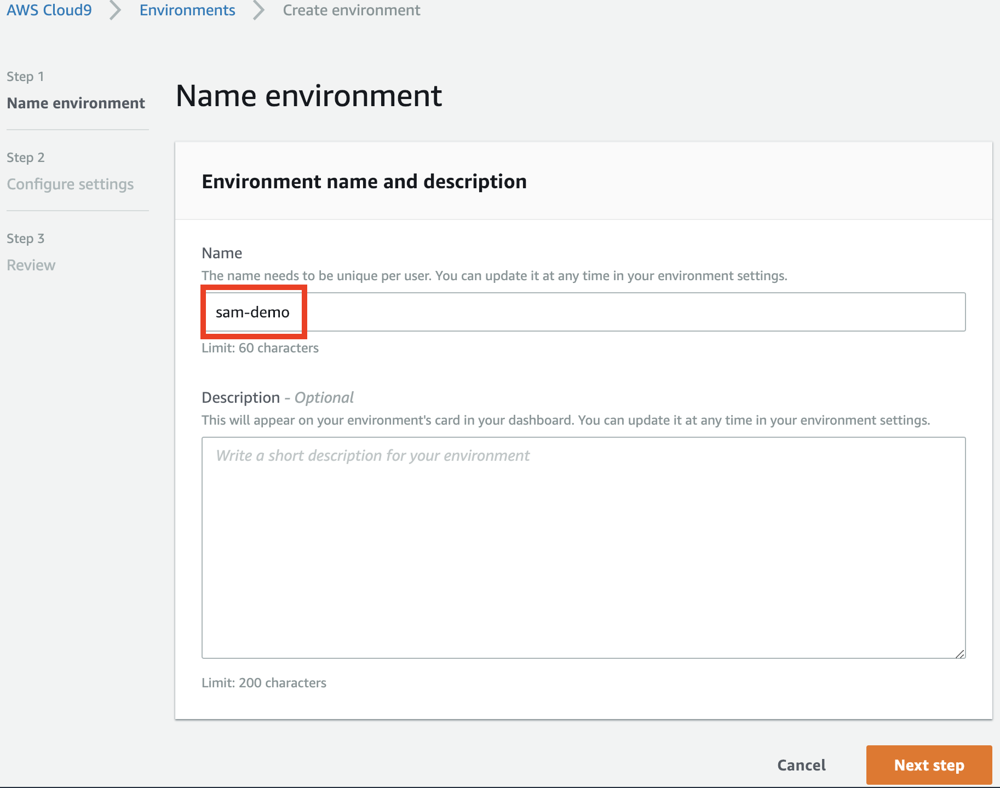
</p>

- On the **Configure settings** page: (use the default settings)<br />
    1. **Environment type**: Choose **Create a new instance for environment (EC2)**.
    2. **Instance Type**: Choose **t2.micro (1 GiB RAM + 1 vCPU)**.
    3. **Cost-saving setting**: Choose **Cost-saving setting**.

<p align="center">
    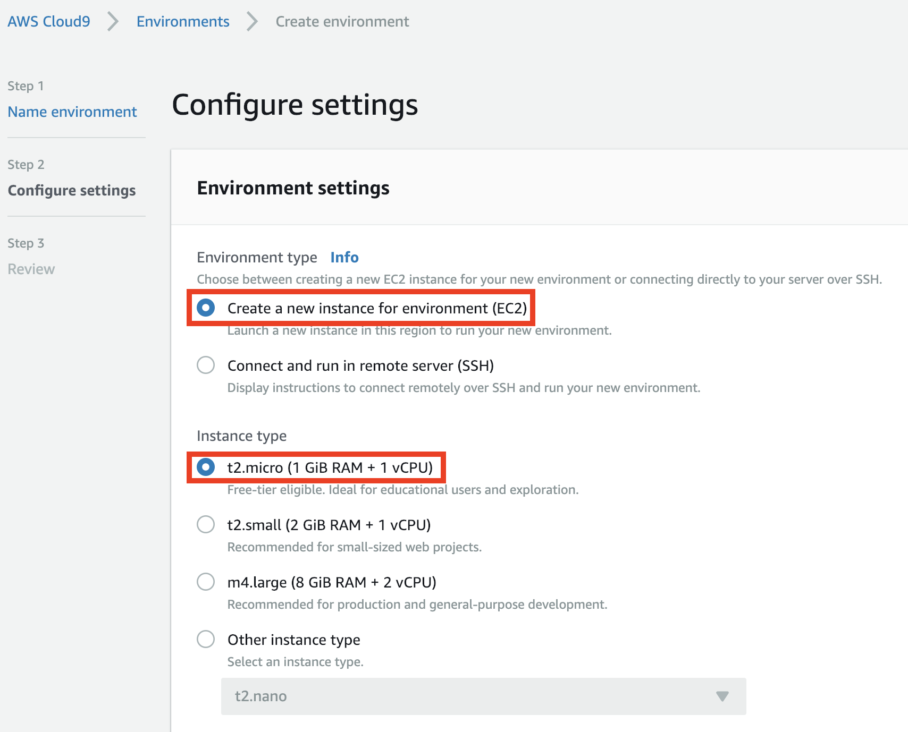
</p>

<p align="center">
    
</p>

- Choose **Next Step**.
- On the **Review** page, choose **Create environment**.
- The environment will be created, set and finally connected. Please wait for a minute.

### **Setting up**

We clone the source code and modify it.

- In **Cloud9** terminal that was opened from the previous step, type the following command to clone the lab source.

```
$ git clone https://gitlab.com/ecloudture/blog/aws-serverless-application-model.git
```

- Type the following command to view the content of the file **template.yaml**. We use the yaml syntax to define our resources
 needed to execute our application. You can also use json syntax to define it.

```
$ cd ~/environment/aws-serverless-application-model
$ cat template.yaml
```

> In this code, we define two Lambda Function **PostItemFunction** and **GetItemFunction**. In addition, we also defined a **DynamoDB table** to store our user's information.

- Now, we will change the table name which defined in the code.

- Open the file **Lambda1.py** and **Lambda2.py** which under the path **serverless-application-model/Lambda/**.

```
Lambda1.py will write data to the database.
Lambda2.py will scan all data from the database.
template.yaml define DynamoDB table.
```

- Open the file **template.yaml** which under the folder **serverless-application-model**.

- Replace the string `<YOUR_TABLE_NAME>` with unique table name, you can name it by yourself as blow:

    - Lambda1.py

    <p align="center">
    
    </p>

    - Lambda2.py

    <p align="center">
    
    </p>

    - template.yaml

    <p align="center">
    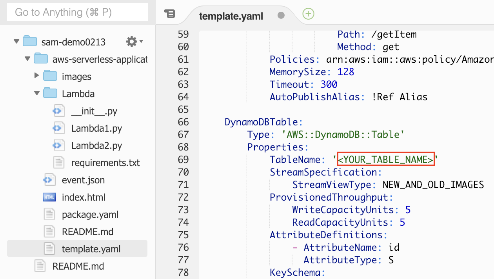
    </p>

- Save all of the above files.

### **Build and deploy**

You will use **AWS SAM CLI** to build a serverless web application.

- The following command create a subdirectory that contains the application code and dependencies. The dependencies will be installed.

```
$ sam build --use-container
```

> Note: The dependencies are described in the **~/environment/aws-serverless-application-model/Lambda/requirement.txt** file.

- Type the following command in terminal to create **[S3](https://aws.amazon.com/tw/s3/) Bucket**. Please replace `<YOUR_BUCKET_NAME>` with unique name.

```
aws s3 mb s3://<YOUR_BUCKET_NAME>
```

> In order to store the packages needed for deployment and host our static website, we create a **S3 Bucket**. 

- Type the command in terminal, then the file **package.yaml** will be created under the "aws-serverless-application-model" folder. Please replace `<YOUR_BUCKET_NAME>` with your bucket name which created in the previous step.

```
$ sam package --output-template-file package.yaml --s3-bucket <YOUR_BUCKET_NAME>
```

> We create the deployment package to **S3** which needed for deploy our web application.

- Now, we use the **deploy** command. Type the command below. Please replace `<YOUR_STACK_NAME>` with your stack name, you can name it yourself.

```
$ sam deploy --template-file package.yaml --stack-name <YOUR_STACK_NAME> --capabilities CAPABILITY_IAM --region us-east-1
```

> **Cloudformation** will create the resources as defined in the template, and group them in an entity called a stack in **Clouformation**.

- Please wait for a while. All of the resources are being created, then you will see the message of "Successfully created/updated stack" as below.

<p align="center">
    
</p>

### **Integrate with static website**

You will create a static website on **S3** and integrate the API endpoint with it.

- On the service menu, choose **CloudFormation**. Type your stack name in the filter, then choose your stack.

<p align="center">
    
</p>

- As you can see, your stack is already in the status of CREATE_COMPLETE.

- Select the **Outputs** section. You can find the **GetItemApi** and **PostItemApi**, copy the value of these key to the textbook.

<p align="center">
    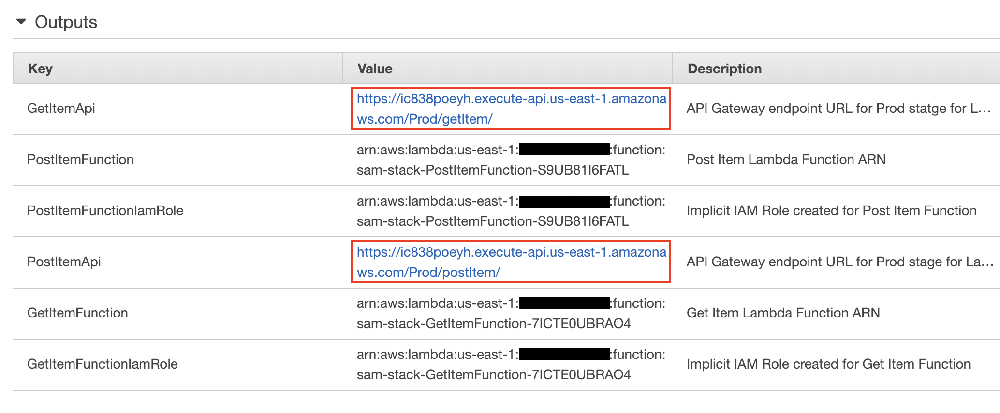
</p>

- In Cloud9, open the file **index.html** under the folder **aws-serverless-application-model**.

- In the bottom half of the **index.html**, replace `<EDNPOINT_FOR_POST_ITEM>` and `<ENDPOINT_FOR_GET_ITEM>` with the value of **PostItemApi** and **GetItemApi** respectively.

<p align="center">
    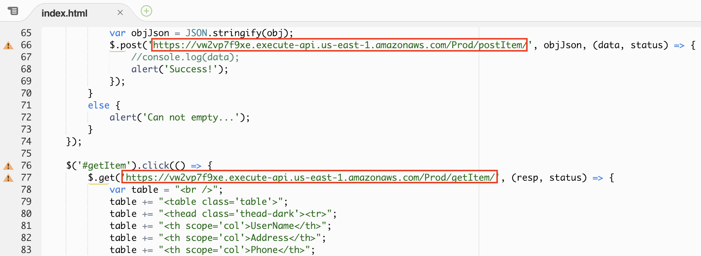
</p>

> This step will allow the web page to call **Lambda Function** through the API.

- Save the file **index.html**.

- In the Cloud9 terminal, type the following command. Please replace `<YOUR_BUCKET_NAME>` with your bucket name which created in the previous step.

```
$ aws s3 cp ~/environment/aws-serverless-application-model/index.html s3://<YOUR_BUCKET_NAME>
```

> The command copy the file **index.html** to **S3 Bucket**.

## **Build static web hosting**

You will setup static web hosting in **S3**.

- On the service menu, choose **S3**. Type your bucket name in the field of **Search for buckets**, then choose your bucket.

<p align="center">
    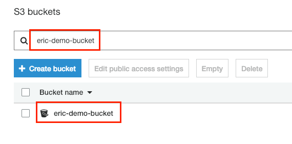
</p>

- Select **index.html**. Choose **Permissions** tab. 

- In the **Public access** section, select **Everyone**.

<p align="center">
    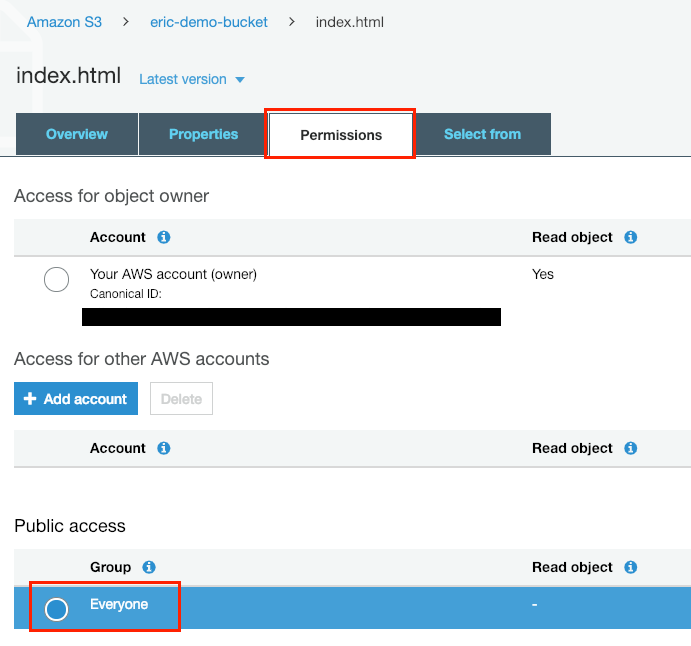
</p>

- In the pop-up window, choose **Read object**. Select **Save**.

<p align="center">
    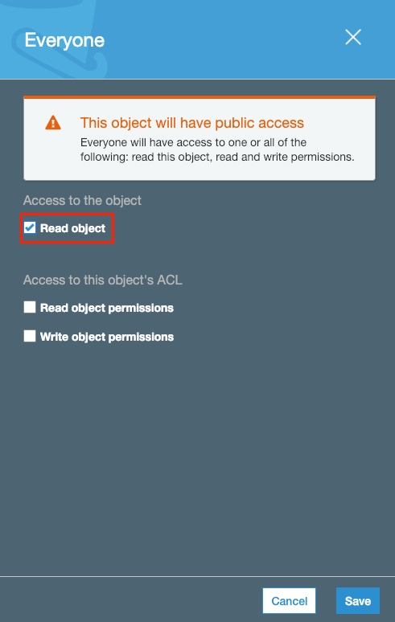
</p>

- Now, **index.html** can be publicly accessed. The next step, we will enable static web hosting.

- Reture to the previous page.

<p align="center">
    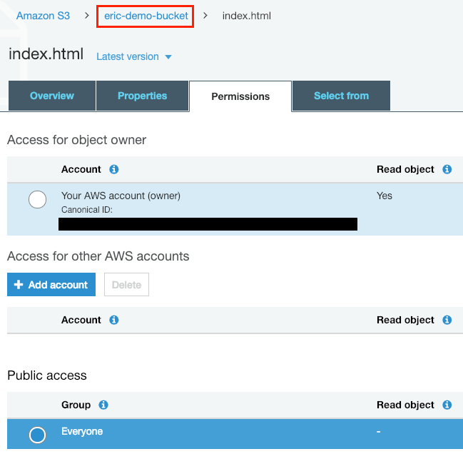
</p>

- Select **Properties** tab.

- Choose **Static web hosting**, then select **Use this bucket to host a website**.

- Type **index.html** for **Index document** field.

<p align="center">
    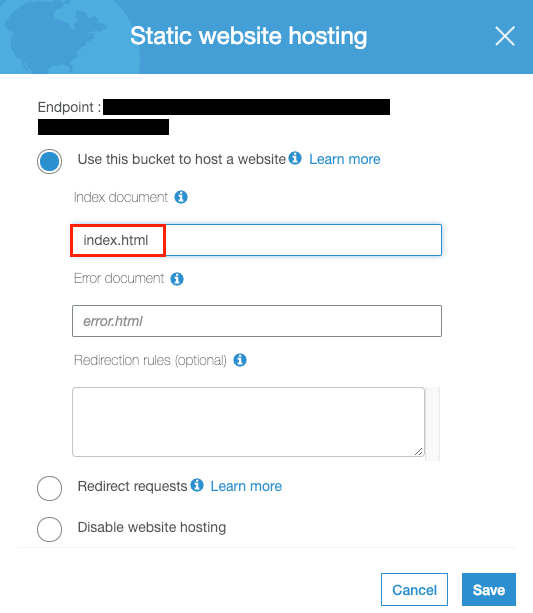
</p>

- Copy the **endpoint** on the top of window to the textbook.

- Choose **Save**.

- At last, paste the endpoint to your browser. You will see the website as bellow:

<p align="center">
    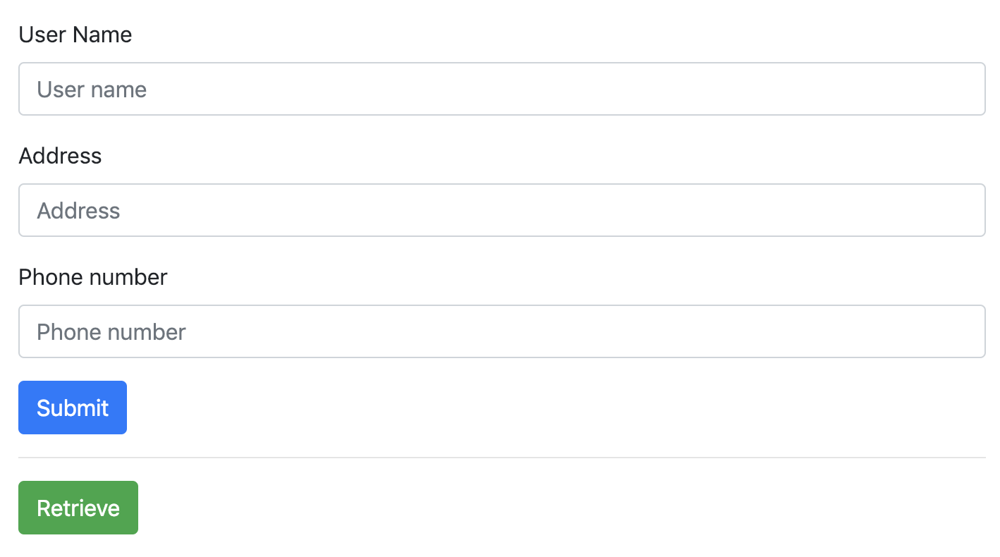
</p>

- Now, you can type data in the fields of **User Name**, **Address**, **Phone** and press the button **"Submit"**. The data will be written to **DynamoDB** table. Press the button **"Retrieve"** to list all the data from **DynamoDB**.

<p align="center">
    
</p>

## **Conclusion**

Congratulations! Now you've learned: <br />

1. Use **Cloud9** to create a development environment.

2. Use **AWS SAM CLI** to build all the packages needed to deploy.

3. Deploy your application to **AWS Cloud** using command.

4. Integrate **endpoint** with web page and create a static website hosting through **S3**.

You built a serverless web application using the above skills. This will allow you to test and deploy your application faster. In addition, serverless architecture will help you reduce costs because you only pay for what you use.

<!-- ## **Clean up**

1. Delete your environment in **Cloud9**.

2. In **CloudFormation**, choose your stackm and then delete it.

3. In **S3**, delete your bucket. -->