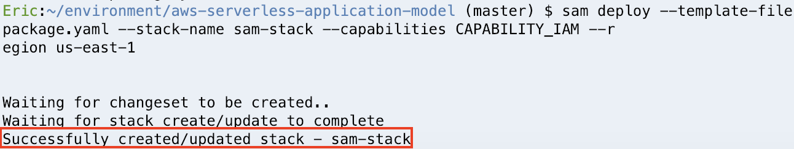
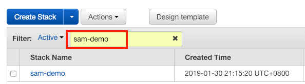

# AWS Serverless Application Model

## **Overview**

The AWS Serverless Application Model (AWS SAM) is an open-source framework that you can use to build serverless applications on AWS.

A serverless application is a combination of Lambda functions, event sources, and other resources that work together to perform tasks. A serverless application is more than just a Lambda function-it can include additional resources such as APIs, databases, and event source mappings.

AWS SAM consists of the following components:

1. AWS SAM template specification: Specification provides a simple and clean syntax to describe the functions, APIs, permissions, configuration, and events that make up a serverless application.You use an AWS SAM template file to operate on a single, deployable, versioned entity that's your serverless application.
2. AWS SAM command line interface (AWS SAM CLI): You use this tool to build serverless applications that are defined by AWS SAM templates. The CLI provides commands that enable you to verify that AWS SAM template files are written according to the specification, invoke Lambda functions locally, step-through debug Lambda functions, package and deploy serverless applications to the AWS Cloud, and so on.

## **Scenario**

In this lab, you will use AWS Serverless Application Model to build a simple serverless web application. This application can read and write item to DynamoDB table. When the data is written to DynamoDB, it will trigger Lambda function to write logs in CloudWatch.
<p align="center">
    
</p>

## **Step by Step**

In the following steps, you will configure the environment required for development, deploy the application and finally test it!

### **Create Cloud9 environment**

We need a **Cloud9** environment to develop our application.

- On the service menu, choose **Cloud9**. Choose **Create environment**.
- On the **Name environment** page, type a **Name** for your environment. Choose **Next step**.

<p align="center">
    
</p>

- On the **Configure settings** page: (use the default settings)<br />
    1. **Environment type**: Choose **Create a new instance for environment (EC2)**.
    2. **Instance Type**: Choose **t2.micro (1 GiB RAM + 1 vCPU)**.
    3. **Cost-saving setting**: Choose **Cost-saving setting**.

<p align="center">
    
</p>

<p align="center">
    
</p>

- Choose **Next Step**.
- On the **Review** page, choose **Create environment**.
- The environment will be created, set and finally connected. Please wait for a minute.

### **Build your web serverless application and deploy it**

In this section, you will use SAM to build a serverless web application by **AWS SAM CLI**.

- In **Cloud9** terminal that was opened from the previous step, type the following command to clone the lab source and change to a directory specified by a path name.

```
$ git clone https://gitlab.com/ecloudture/blog/aws-serverless-application-model.git
$ cd ~/environment/aws-serverless-application-model
```

- Type the following command to view the content of the file **template.yaml**. We use the yaml syntax to define our resources
 needed to execute our application. You can also use json syntax to define.

```
$ cat template.yaml
```

- In this code, we define two Lambda Function **PostItemFunction** and **GetItemFunction**. In addition, we also defined a **DynamoDB table** to store our user's information.

- The following command create a subdirectory that contains the application code and dependencies. The dependencies will be installed.

```
$ sam build --use-container
```

> Note: The dependencies are described in the **~/environment/aws-serverless-application-model/Lambda/requirement.txt** file.

- In order to store the packages needed for deployment and host our static website, we create a **S3 Bucket**. Type the following command in terminal. Please replace "<YOUR_BUCKET_NAME>" with unique name.

```
aws s3 mb s3://<YOUR_BUCKET_NAME>
```

- In the following command, we create the deployment package needed for deploy our web application. Type the command in terminal, then the file **package.yaml** will be created under the "aws-serverless-application-model" folder. Please replace "<YOUR_BUCKET_NAME>" with your bucket name which created in the previous step.

```
$ sam package --output-template-file package.yaml --s3-bucket <YOUR_BUCKET_NAME>
```

- Now, we use the **deploy** command. Type the command below, **Cloudformation** will create the resources as defined in the template, and group them in an entity called a **stack** in **Clouformation**. Please replace "<YOUR_STACK_NAME>" with your stack name, you can name it yourself.

```
$ sam deploy --template-file package.yaml --stack-name <YOUR_STACK_NAME> --capabilities CAPABILITY_IAM --region us-east-1
```

- Please wait for a while. All of the resources are being created, then you will see the message of "Successfully created/updated stack" as below.

<p align="center">
    
</p>

### **Integrate with static website**

In this section, you will create a static website on **S3** and integrate the API endpoint with it.

- On the service menu, choose **CloudFormation**. Type your stack name in the filter, then choose your stack.

<p align="center">
    
</p>

- As you can see, your stack is already in the status of "CREATE_COMPLETE".

- Select the **Outputs** section. You can find the **GetItemApi** and **PostItemApi**, copy the value of these key to the textbook.

<p align="center">
    
</p>

- In Cloud9, open the file **index.html** under the folder **aws-serverless-application-model**.

- In the bottom half of the **index.html**, replace "<EDNPOINT_FOR_POST_ITEM>" and "<ENDPOINT_FOR_GET_ITEM>" with the value of **PostItemApi** and **GetItemApi** respectively.

<p align="center">
    
</p>

- In the Cloud9 terminal, type the following command. The command copy the file to **S3 Bucket**. Please replace "<YOUR_BUCKET_NAME>" with your bucket name which created in the previous step.

```
$ aws s3 cp ~/environment/aws-serverless-application-model/index.html s3://<YOUR_BUCKET_NAME>
```

- On the service menu, choose **S3**. Type your bucket name in the field of **Search for buckets**, then choose your bucket.

<p align="center">
    
</p>

- Select **index.html**. Choose **Permissions** tab. 

- In the **Public access** section, select **Everyone**.

<p align="center">
    
</p>

- In the pop-up window, choose **Read object**. Select **Save**.

<p align="center">
    
</p>

- Now, **index.html** can be publicly accessed. The next step, we will enable static web hosting.

- Reture to the previous page.

<p align="center">
    
</p>

- Select **Properties** tab.

- Choose **Static web hosting**, then select **Use this bucket to host a website**.

- Copy the endpoint on the top of window to the textbook.

- Type **index.html** for index document field, then choose **Save**.

<p align="center">
    
</p>

- At last, paste the endpoint to your browser. You will see the website as bellow:

<p align="center">
    
</p>

- Type values in those fileds to test your web application.

### **Create new Lambda function**

In this section, you will create a Lambda funtion. When the data is written to DynamoDB through your website, this Lambda will be triggered to write the logs to **CloudWatch**.

- Copy the following code. This code set the parameter configuration required to create Lambda function and capture the table activity with **DynamoDB** stream.

```
    DetectItemFunction:
        Type: AWS::Serverless::Function
        Properties:
            CodeUri: ./Lambda
            Handler: Lambda3.lambda3_handler
            Runtime: python3.6
            Events:
                DetectEvent:
                    Type: DynamoDB
                    Properties:
                        Stream:
                            !GetAtt DynamoDBTable.StreamArn
                        StartingPosition: TRIM_HORIZON
                        BatchSize: 10
            Policies: arn:aws:iam::aws:policy/AmazonDynamoDBFullAccess
            AutoPublishAlias: !Ref Alias

```

- In **Cloud9**, open **template.yaml** under the folder **aws-serverkess-application-model**.

- Paste the code into **template.yaml** behind the **GetItemFunction** section as below:

<p align="center">
    
</p>

- Save file.

- In the following command, we have added a python file to write the code in Lambda function.

```
$ cd ~/environment/aws-serverless-application-model/Lambda
$ touch Lambda3.py
```

- Open the file **Lambda3.py**, paste the following code. 

```
def lambda3_handler(event, context):
    print('hello world')
```

- Save file.

### **Deploy your web application again**

In this section, you will deploy your web application again due to the project has been modified.

- The following command create a subdirectory that contains the application code and dependencies. The dependencies will be installed.

```
$ cd ~/environment/aws-serverless-application-model
$ sam build --use-container
```

- The following command, you can test your Lambda function locally. Type at terminal, then you will see the execution result of Lambda function as below.

```
$ sam local invoke DetectItemFunction --event event.json
```

<p align="center">
    

- The following command, create the deployment package then deploy all of resources that you defined in the template. Please replace <YOUR_BUCKET_NAME> and <YOUR_STACK_NAME>.

```
$ sam package --output-template-file package.yaml --s3-bucket <YOUR_BUCKET_NAME>
$ sam deploy --template-file package.yaml --stack-name <YOUR_STACK_NAME> --capabilities CAPABILITY_IAM --region us-east-1
```


- Wait for a while, then you will see the "Successfully created/updated stack" message.

### **Test your web application**

- Reload the web page and enter the values in those fields to test your website.

<p align="center">
    

- On the service menu, choose **Lambda**.

- In the filter, type **DetectItemFunction** and choose your lambda function.

- Choose **Monitoring** tab, then select **View logs in CloudWatch**.

- In the new tab, choose log streams.

- Because the new data was written in **DynamoDB**, you will see the logs "hello word" which created by **Lambda3**.

<p align="center">
    

## **Conclusion**

Congratulations! Now you've learned: <br />

1. Create a **Cloud9** environment.

2. Test your **Lambda Function** locally.

3. Use **AWS SAM CLI** to build and deploy all of the resources that you defined in the template to **AWS Cloud**.

4. Create a static website hosting through **S3**.

5. Integrate API Gateway endpoint with static website.