# **AWS Serverless Application Model**

## **前言**

無伺服器架構是一種無須管理基礎設施即可建立和執行應用程式及服務的方法，可讓您的應用程式擁有更高的敏捷度以及更低的總成本。該架構讓開發人員專注於應用程式的開發，減輕開發人員的負擔，使他們得以開發更可靠、優質的產品。

[**AWS Serverless Application Model**](https://docs.aws.amazon.com/zh_tw/lambda/latest/dg/serverless_app.html)(AWS SAM)為開放原始碼的框架，您可以運用此框架在AWS平台上建立無伺服器應用程式。
無伺服器應用程式由多個**Lambda**函數、事件、資料庫、API⋯等其他資源共同組成以實作出系統功能。

**AWS SAM**由以下兩種元素組成：

1. AWS SAM template specification:</br>
Template specification提供簡潔的語法定義無伺服器應用程式所使用到的Lambda函數、APIs、權限、事件⋯等資源。

2. AWS SAM命令列介面 (AWS SAM CLI):</br>
您可以使用此工具建立無伺服器應用程式。SAM CLI指令可讓您驗證Template specification所定義的內容、在本地端測試Lambda函數、打包與部署應用程式至AWS平台上。

## **情境**

在本實驗中，您將使用**AWS SAM**建立無伺服器的網頁應用程式。以**Amazon Cloud9**作為開發環境，透過**AWS SAM template specification**定義應用程式所需的資源，最後使用**AWS SAM CLI**測試、部署應用程式。該網頁應用程式可將資料寫入**DynamoDB**的資料表並從中讀取資料顯示於網頁。

<p align="center">
    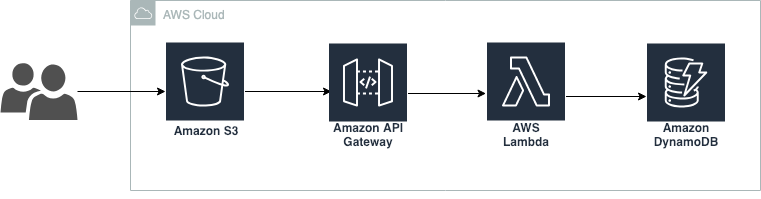
</p>

## **步驟**

### **建立Cloud9環境**

我們需使用**Cloud9**作為應用程式的開發環境。

- 在Service選單中，點選**Cloud9**，接著選擇**Create environment**。
- 在**Name environment**頁面，於**Name**欄位輸入應用程式名稱，點選**Next step**。

<p align="center">
    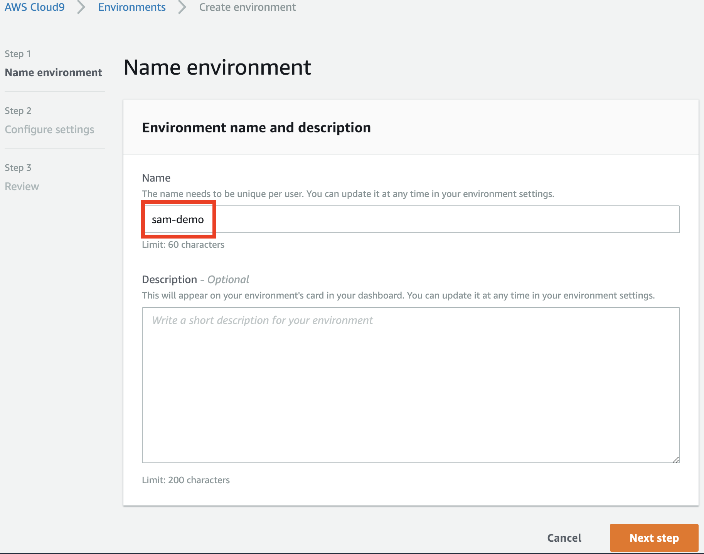
</p>

- 於**Configure settings**頁面：（保留預設值）
    1. **Environment type**：請選擇**Create a new instance for environment (EC2)**；
    2. **Instance Type**：請選擇**t2.micro (1 GiB RAM + 1 vCPU)**；
    3. **Cost-saving setting**：請選擇**Cost-saving setting**。

<p align="center">
    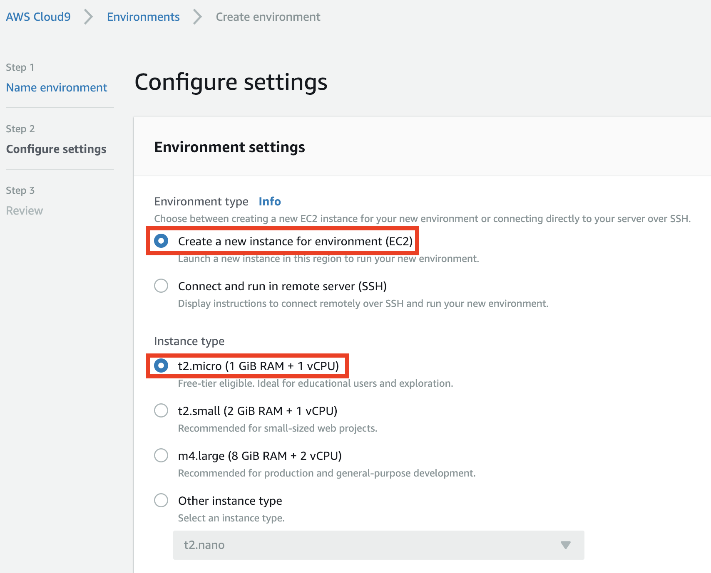
</p>

<p align="center">
    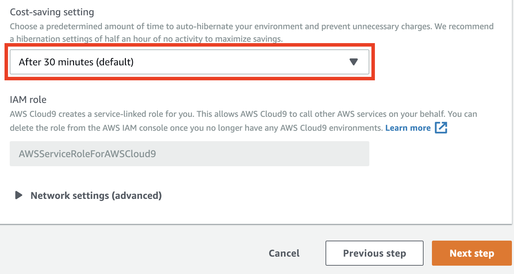
</p>

- 點選**Next Step**。
- 於**Review**頁面，點選**Create environment**。
- 開發環境將被建立、設定並且連線，請等待約1分鐘。

### **設定**

在這個章節中，您將下載本實驗所需的原始碼並修改它。

- 在**Cloud9**的終端機上，輸入下列指令：

```
$ git clone https://gitlab.com/ecloudture/blog/aws-serverless-application-model.git
```

> 該指令將clone本實驗所需的原始碼，並將路徑更改至指定的資料夾下。

- 請輸入下列指令來查看檔案**template.yaml**的內容：

```
$ cd ~/environment/aws-serverless-application-model
$ cat template.yaml
```

> 我們使用yaml語法來定義執行應用程式所需的資源，程式中定義了兩個Lambda函數：**PostItemFunction**和**GetItemFunction**；此外，我們也定義了DynamoDB資料表來儲存使用者輸入的資料。

- 接下來的步驟，我們將修改定義於程式碼內的資料表名稱，以確保資料表名稱不會重複。

- 請開啟位於目錄**serverless-application-model/Lambda**底下的檔案**Lambda1.py**和**Lambda2.py**。

- 請開啟位於目錄**serverless-application-model**底下的檔案**template.yaml**。

- 請取代上述三個檔案內的字串"<YOUR_TABLE_NAME>"為資料表名稱，名稱可自行命名，取代位置如下圖所示：

    - Lambda1.py
    
    <p align="center">
    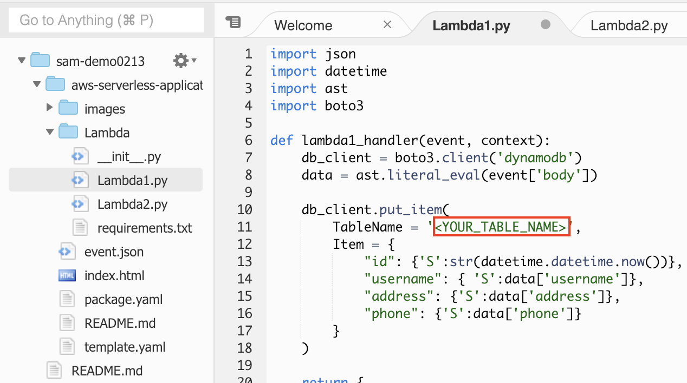
    </p>

    - Lambda2.py

    <p align="center">
    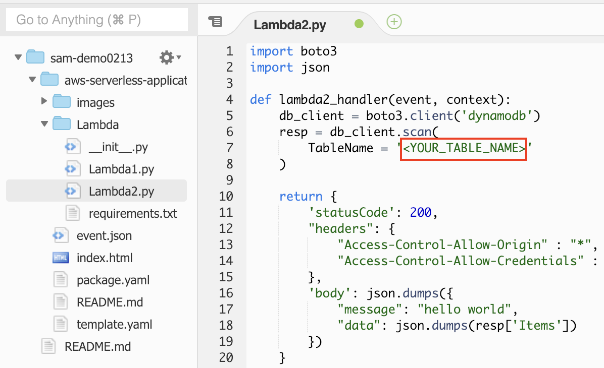
    </p>

    - template.yaml

    <p align="center">
    
    </p>

- 請記得儲存上述修改過的檔案。

### **建置與部署**

在這個章節中，您將使用**AWS SAM**建立網頁應用程式並且透過**AWS SAM CLI**部署至**AWS**平台。

- 請輸入下列指令以安裝相依套件及建立子資料夾，該資料夾包含應用程式的程式碼與相依套件。

```
$ sam build --use-container
```

> 要安裝的相依套件被設置在目錄 ~/environment/aws-serverless-application-model/Lambda 底下的檔案requirement.txt。

- 輸入下列指令新增**S3 Bucket**，請替換指令中的"<YOUR_BUCKET_NAME>"為自己的Bucket名字，名字不得重複。

```
aws s3 mb s3://<YOUR_BUCKET_NAME>
```

> **S3 Bucket**將被用來放置靜態網頁以及部署應用程式所需的套件。

- 輸入下列指令建立部署應用程式所需的套件，請將指令中的"<YOUR_BUCKET_NAME>"替換為上一步所新增的Bucket名字。

```
$ sam package --output-template-file package.yaml --s3-bucket <YOUR_BUCKET_NAME>
```

> 輸入指令後，**package.yaml**會被新增至"aws-serverless-application-model"資料夾底下。

- 請輸入下列指令，**Cloudformation**會依據定義在template的內容建立資源。請將指令中的"<YOUR_BUCKET_NAME>"替換為自己的Bucket名字。

```
$ sam deploy --template-file package.yaml --stack-name <YOUR_STACK_NAME> --capabilities CAPABILITY_IAM --region us-east-1
```

> 由**CloudFormation**建立的資源集合被稱為**stack**。

- 請稍待片刻，**Cloudformation**正在建立應用程式所需的資源。建立完成後，您將會看到訊息"Successfully created/updated stack"，如下圖所示：

<p align="center">
    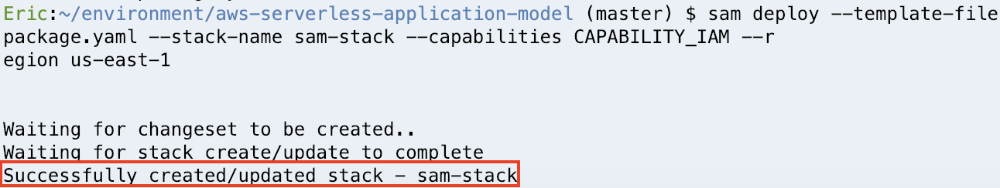
</p>

### **整合API至網頁**

在這個章節中，您將使用**S3**建立靜態網站，並且整合**API endpoint**至網頁中。

- 在Service選單中，點選**Cloudformation**；於**Filter**欄位輸入**stack**的名字，並點選你的**stack**。

<p align="center">
    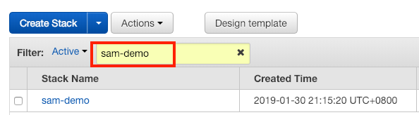
</p>

> 點選你的**stack**後，將會看到**stack**的狀態為"CREATE_COMPLETE"，表示所有資源已建立完成。

- 在**Outputs**中，找到**GetItemApi**和**PostItemApi**的值，將其複製到剪貼簿中，以便後續使用。

<p align="center">
    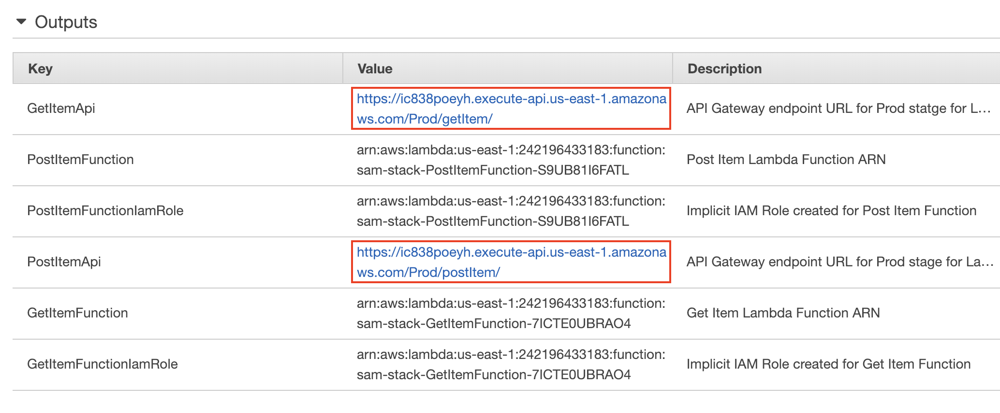
</p>

- 在**Cloud9**中，打開檔案**index.html**，該檔案位於**aws-serverless-application-model**資料夾底下。

- 在下半部的程式碼，請取代"<EDNPOINT_FOR_POST_ITEM>"為**PostItemApi**的值；以及取代"<ENDPOINT_FOR_GET_ITEM>"為**GetItemApi**的值，如下圖所示：

<p align="center">
    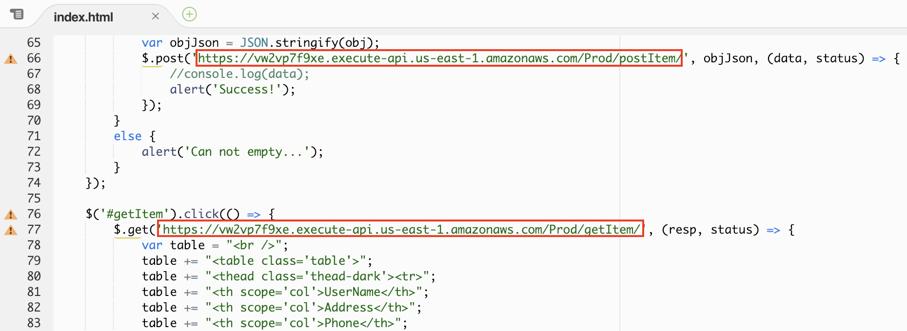
</p>

- 儲存檔案**index.html**

- 於**Cloud9**的終端機上，請取代下列指令中的"<YOUR_BUCKET_NAME>"為自己的**Bucket**名字，並輸入指令至終端機：

```
$ aws s3 cp ~/environment/aws-serverless-application-model/index.html s3://<YOUR_BUCKET_NAME>
```

> 該指令會將**index.html**複製到**S3 Bucket**。

### **設置靜態網頁**

在本章節中，您將使用**S3**設置靜態網頁。

- 在Service選單中，點選**S3**；於**Search for buckets**欄位輸入你的**Bucket**名字，點選你的**Bucket**。

<p align="center">
    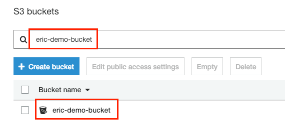
</p>

- 點選**index.html**，選擇**Permissions**分頁。

- 在**Public access**區塊，選取**Everyone**。

<p align="center">
    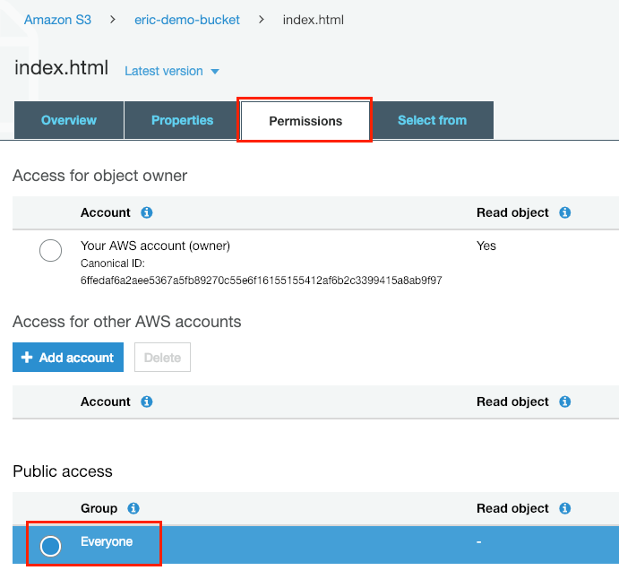
</p>

- 於彈跳出的視窗中，選取**Read object**並點選**Save**。

<p align="center">
    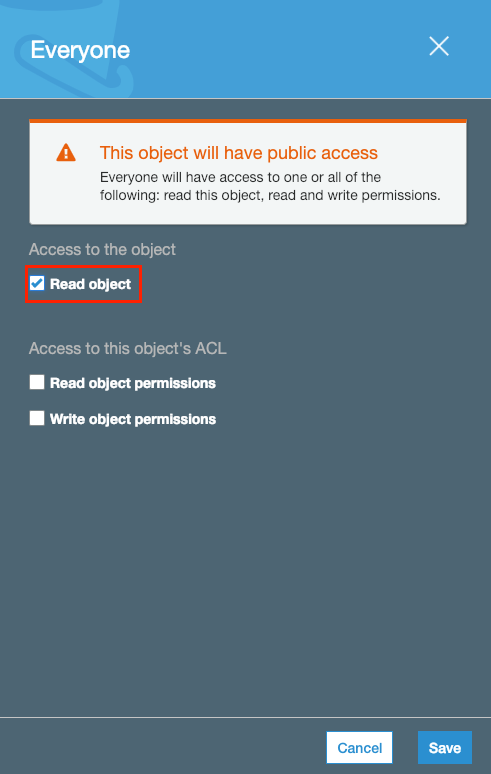
</p>

> 到目前的步驟，**index.html**已可被公開存取。

- 返回至前一頁，如下圖所示，點擊**Bucket**名字。

<p align="center">
    
</p>

- 點選**Properties**分頁。

- 點選**Static web hosting**，接著選取**Use this bucket to host a website**。

- 在**index document**欄位輸入**index.html**。

<p align="center">
    
</p>

- 複製區塊上方的**endpoint**，點選**Save**。

- 最後，將**endpoint**貼上至瀏覽器，按下Enter，您將看到以下畫面：

<p align="center">
    
</p>

- 您可以於**User Name**、**Address**、**Phone number**欄位輸入資料，並按下按鈕**Submit**，資料將被寫入**DynamoDB**；按下按鈕**Retrieve**可從**DynamoDB**讀取所有資料，並顯示於網頁上。如下圖所示：

<p align="center">
    
</p>

## **結論**

恭喜！您已經可以使用**AWS SAM**建立無伺服器應用程式，您在本實驗中學到：

1. 使用**Cloud9**建立開發環境；

2. 使用**AWS SAM CLI**建置部署所需的套件；

3. 利用指令將應用程式部署至**AWS Cloud**；

4. 將**endpoint**整合進網頁，並使用**S3**建立靜態網站。